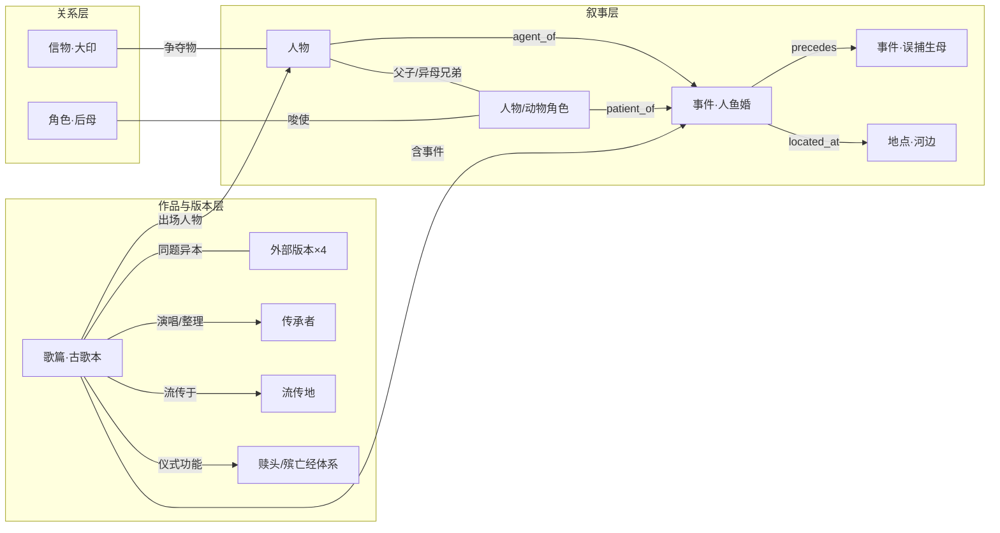

# 布依族古歌人物知识图谱 · 设计方案

> **版本**: v1.1（选篇已定：安王与祖王，单篇深做）
> **日期**: 2026-09-29
> **语料基线**: `布依族资源/` 三册全量 OCR（古歌 v1.0-ocr 全本 989 页 / 古谢经 v1.4-ocr 430 页 / 文化大观 v1.1-ocr 524 页）
> **证据指针协议**: `doc_id + page + line_no`，引用一律附 `canon_version`
> **本文档性质**: 选篇理由、贴合《安王与祖王》的本体设计、构建流水线、评测与风险、AIGC 演绎层设计（不实施）

依据说明：篇目评估来自 2026-09-29 对三路语料的逐页普查——(a) 爱情叙事古歌五篇（p739-985）意译层细读；(b) 风俗古歌八篇（p295-737）逐篇判定；(c) 《文化大观》全本 524 页关键词检索；(d) 互联网学术资料检索（§1.4）。

---

## 1. 选篇决策

### 1.1 候选全量对比（创世古歌 12 首之外的 13 篇）

| 篇名 | 部 | 页码 | 页数 | 性质 | 有名人物 | 关系对(约) | KG 评分 | 跨文档可链性 | 篇尾元数据 |
|------|----|------|-----|------|---------|-----------|--------|-------------|-----------|
| **安王与祖王** | 爱情叙事 | p904-985 | 82 | 神话史诗 | **5**（盘果、鱼女、安王、祖王、玄王） | **12** | **5** | ★★★ 大观安王137次/祖王112次/盘果28次，P121《穆播董》完整复述；摩经赎头功能；多版本 | 意译层尾部乱码，S0 回查 full 层 |
| 采天花 | 风俗 | p616-712 | 97 | 信仰历险史诗 | **10+**（金秀小姐、安小姐、凤小姐、先锋王爷、三老爷罗若罗他、甘香甘爱、由贵由来、天上老母、哑巴守门人等） | 密（求花体系） | **5** | ★★ 大观圣母23/花王9/祧25（概念链） | 待回查 full 层 |
| 马赛 | 爱情叙事 | p847-903 | 57 | 世俗叙事 | 2（马赛、桃女） | 7 | **4** | ☆ 大观 0 命中 | 仅搜集时间（1984-9） |
| 范龙 | 爱情叙事 | p809-846 | 38 | 世俗叙事 | 3（范龙、让中、范宝） | 8 | **4** | ☆ | 缺失 |
| 砍马经 | 风俗 | p489-522 | 34 | 仪式叙事 | 5 神话名（龙太子、龙王女、马祖、天上公公/云里娘娘、王母） | 亲缘链完整 | **4** | ★★ 通《古谢经》体系；"砍马经"术语与苗族《亚鲁王》研究交叉 | full 层 p522 完整（贵定昌明/杨甫凡/1987-4） |
| 范朗与媚香 | 爱情叙事 | p767-808 | 42 | 世俗叙事 | 2（范朗、媚香） | 8 | 3.5 | ☆ | p808 存（独山荔波/黎国平/黎鸣/1987-5） |
| 凤明和龙妹 | 爱情叙事 | p739-766 | 28 | 世俗叙事 | 2（凤明、龙妹） | 5 | 3 | ☆ | 部分缺（演唱人覃报/1988-12） |
| 送花歌 | 风俗 | p574-615 | 42 | 仪式+洪水神话 | 1（大王）+圣母 | 甥舅送花体系 | 3 | ★ 大观"送花"25 次 | p615 完整（荔波黎明村/黎朝美/黎汝标/1986-3） |
| 摩经·温（选译） | 风俗 | p297-487 | 191 | 抒情对唱+起源神话 | 1（王代） | 类型全但角色型无名 | 3 | ★★ 摩经137/殡亡经41 概念强链 | p487 存（年份疑 OCR 误） |
| 开道歌 | 风俗 | p720-737 | 18 | 纯仪式（傩仪） | 神格（三元、桥良王） | 仅人神 | 2 | ★ 傩神格可互链 | p737 完整（荔波独山/黎国举/黎鸣/1987-5） |
| 添粮补寿经 | 风俗 | p558-572 | 15 | 仪式+病因神话 | 1（郎达官） | 仅人神 | 2.5 | ★ 郎达为特色神格 | p572 存（惠水长顺/梁朝文/卜越） |
| 祭土地神经 | 风俗 | p524-556 | 33 | 纯仪式 | 0 | 仅主家—神灵 | 1.5 | ★ 土地神节点 | 意译层未见 |
| 十一月生产歌 | 风俗 | p713-719 | 7 | 月令抒情 | 0 | 仅人神供祭 | 1.5 | ★ 花园神格佐证 | p719 残（黎国平/覃西/荔波） |

> **结构性发现**：意译层（verse 视图）不含散文导读、节标题与部分篇尾元数据行，上表"待回查/缺失"多数属伪缺失，S0 从 `full_zh.txt` 层对齐补齐。《摩经·温》导读列 13 节而意译层仅见后 5 节（猜歌 p297/兴情侣 p335/逃婚 p407/贬抑 p444/分离 p463），属书本选译还是转换缺失，S0 对照 full 层裁定。

### 1.2 分档

- **第一梯队**：安王与祖王、采天花、马赛、范龙、砍马经
- **第二梯队（扩谱候选）**：范朗与媚香、凤明和龙妹、送花歌、摩经·温
- **建议排除**（仅作神格属性源）：祭土地神经、添粮补寿经、十一月生产歌、开道歌

### 1.3 选篇决策：安王与祖王（单篇深做）

> **决策记录**：2026-09-29 定。首批建谱篇目为《安王与祖王》单篇（p904-985，82 页）；采天花、马赛、范龙、砍马经列为二期扩谱候选（见 §1.5 路线图）。

**选定理由（五条）**：

1. **文本内部质量全书第一（普查 5/5 分）**。82 页为全书最长单篇；有名人物 5 个、功能角色约 10 个；约 12 组关系对、关系类型全书最全——人异类婚（盘果×鱼女）、父子、异母兄弟、继母子、唆使、加害（填井）、救助（雷中救子）、遣使（鹰鸦）、降灾、争地争印、纳贡——14 个情节节拍构成完整叙事弧：**婚→生→离→争→害→救→罚→分**。作为对照：世俗长诗（马赛、范龙）虽情节分明，但有名人物仅 2-3 人、配角全部无名，关系网的"多实体多类型"密度不及本篇。
2. **外部研究存量断崖式第一（互联网检索证实，§1.4）**。拥有专书整理本（望谟 1994）、**Brill 国际英译专书**（Holm *Hanvueng*，含原抄本对照）、周国茂国家社科课题、王斯博士论文（与《亚鲁王》《支嘎阿鲁王》并置）、舜象故事同源说/《摩诃婆罗多》/壮族《麽经布洛陀》比较研究、《中华创世神话选注》收录、云村寨专文与百科词条。图谱的每类实体与关系都有二手文献可互证——**每条边可辩护**，这是评审与学术复用最看重的一点。
3. **唯一可做多版本对齐的篇，天然覆盖 KG 方法学两大核心问题**。五个版本在案：古歌本（p904-985）↔ 望谟 1994 整理本 ↔ 《罕温与索温》异名本 ↔ Holm 英译本 ↔ 大观《穆播董》复述。别名消歧（安王/罕温/Hanvueng；祖王/索温/岸王梭王系）与版本链建模（各版结局不同，§4.2）正是实体对齐与溯源两大难题的现成实验材料——别的篇给不了。
4. **三册语料的枢纽**。其一，云村寨《"论王"》载本篇为摩经经卷，用于"赎头"仪式（为非正常死亡者招魂超度）——由此建 `安王与祖王—[仪式功能]→殡亡经体系 ≡ 古谢经专书` 跨册边；其二，盘果王/鱼女感生母题通大观创世章；其三，大观对本篇人物的高频命中（安王 137/祖王 112/盘果 28 次，P121-122《穆播董》完整复述）提供逐段对齐材料。**一个故事把三册语料全部挂起来。**
5. **故事本身最吸引人，且是 AIGC 演绎层的最佳素材**。人鱼奇婚（河畔赞鱼、鱼女夜来吹笛弹弦）、误捕生母（安王捕鱼欲烹"外祖父外祖母"、生母遁水成孤儿——全书情感核心）、后母偏私与唆事、兄弟斗法（互施鸟灾/黑暗长夜/瘟疫 vs 织网/火炬/雷火）、填井阴谋、雷中救子、上天降灾、分地纳贡——戏剧密度与画面感在 25 篇中无可匹敌。

**诚实标注本次选型的代价**：单篇深做意味着世俗层叙事（马赛的人情冷暖、范龙的市井冲突）暂不入谱，图谱的文化覆盖面窄于三篇组合；缓解办法是 §1.5 扩谱路线图——schema 与流水线按"可复用到任意篇"设计，二期扩谱只需追加语料切片与人物表。

### 1.4 外部研究资料丰富度（互联网检索，2026-09-29）

检索方法：8 组中英文查询，覆盖 13 篇候选篇名 + 核心人物名 + 变体名（罕温/索温）+ 英译本。

| 排名 | 篇章/体系 | 外部资料等级 | 已核实的资料类型 |
|------|----------|------------|----------------|
| **1** | **安王与祖王** | **极丰（独一档）** | ① 专书整理本：望谟县民族事务委员会编《安王与祖王》（贵州民族出版社 1994），望谟卷 1700 余行为最长布依族叙事史诗；② **国际英译专书**：David Holm 译注 *Hanvueng: The Goose King and the Ancestral King*（Brill《Zhuang Traditional Texts Series》第 1 卷，含原抄本对照），被国际侗台平行体诗学文献引用（Fox 2024 等）；③ 国家社科基金课题"布依族史诗典籍《安王与祖王》珍善本搜集整理研究"（周国茂）；④ 博士论文：王斯《贵州苗、布依、彝族英雄叙事长诗研究》；⑤ 比较研究多篇：舜象故事同源说（刘亚虎等）、《摩诃婆罗多》、壮族《麽经布洛陀》；⑥ 《中华创世神话选注·世界万物起源卷》收录《混沌王与盘果王》；⑦ 云村寨专文（《"论王"：从神圣到凡俗》等）详载**赎头仪式功能**、流传地（望谟罗甸贞丰册亨安龙兴仁关岭镇宁，望谟本最全）与龙鱼雷北斗图腾；⑧ 异名本《罕温与索温》见于著录；⑨ 百度百科布依族神话/摩经、维基百科布依族文学词条 |
| 2 | 摩经体系（本篇的类属层） | 丰 | 周国茂《摩教与摩文化》《布依族摩经文学》、周国炎《布依文文献选读》《布依族古籍文献研究文集》、云村寨摩经系统专文（殡亡经/傩书/邦经三分）。**方言链**：丧葬仪式第一土语区称"殡亡"、第二土语区"砍牛"、第三土语区"古谢亡"——殡亡经=砍牛经=古谢经 |
| 3 | 采天花 | 中（文本薄、仪式厚） | 《中国各民族原始宗教资料集成·布依族卷》求子仪式专节含"采天花"；花婆/圣母信仰研究 |
| 4 | 砍马经 | 低（直接）/中高（间接） | 布依直接专题少；"砍马经"术语被苗族《亚鲁王》研究占据（"砍马经=指路经"）——跨民族比较通道兼术语歧义源 |
| 5 | 送花歌 | 中低 | 大观 P151 明载；资料集成背景 |
| 6 | 马赛、范龙、范朗与媚香、凤明和龙妹 | 薄 | 仅云村寨《摩教语言艺术的类型及其主要作品》提及《范朗与媚香》《马赛》 |

### 1.5 扩谱路线图

- **M2（二期）**：+砍马经（激活古谢经跨册桥与"砍马送亡"跨民族比较）；+采天花（人物数最多的信仰史诗，圣母体系）
- **M3（三期）**：+马赛（关系反转样本）、范龙（信物验证样本）；创世部 12 首按需接入（大观创世章已就位）

---

## 2. 本体设计（贴合《安王与祖王》）

### 2.1 本篇的人物-事件底盘（十四节拍表）

| # | 节拍 | 页码 | 涉及实体 |
|---|------|------|---------|
| 1 | 盘果河畔赞鱼；鱼女夜来吹笛弹弦，成婚 | p904-909 | 盘果、鱼女 |
| 2 | 安王出生；13 岁捕鱼欲烹"外祖父外祖母"，鱼母遁水，成孤儿 | p910-913 | 安王、鱼女 |
| 3 | 两商人两度说媒，盘果娶寡妇 | p915-933 | 盘果、后母、商人×2 |
| 4 | 兄弟河边抢鱼争地，结冤 | p933-934 | 安王、祖王 |
| 5 | 后母送饭不均（艾枝下/枸树上），祖王告状 | p935-946 | 后母、安王、祖王 |
| 6 | 后母唆祖王"杀哥夺大印" | p946-948 | 后母、祖王、大印 |
| 7 | 兄弟斗法：互施鸟灾/黑暗长夜/痢疾天花 vs 织网/火炬/雷火 | p948-961 | 安王、祖王 |
| 8 | 安王召兵，父气病 | p962 | 安王、盘果 |
| 9 | 祖王遣鹰、鸦使请兄归 | p963-969 | 祖王、鹰使、鸦使 |
| 10 | 父索"巧简井、苏者鲶"水；兄弟掘井，祖王填土害兄 | p969-977 | 盘果、安王、祖王 |
| 11 | 鱼母雷中救子，抛出洞外 | p977-978 | 鱼女、安王 |
| 12 | 兄弟相打，安王飞上天 | p978-979 | 安王、祖王 |
| 13 | 安王降鸟灾、黑夜、瘟疫；祖王遍寻大哥 | p980-982 | 安王、祖王、百姓 |
| 14 | 老人公证分河分地；安王不受，令年年纳贡（"小孩作租子"），百姓方安 | p982-985 | 安王、祖王、公证老人、百姓 |

（节拍表同时是 S0 切片粒度、S2-R3 事件链抽取的目标骨架、评测的 ground-truth 骨架。）

### 2.2 实体类型（10 类，本篇实例化）

| 类型 | 说明 | 本篇实例（含页码） |
|------|------|------------------|
| `Person` 人物 | 有名者，属性 `kind=凡人\|半神\|神灵\|动物角色` | 盘果（凡人）、安王（半神：鱼女所生）、祖王（凡人）、玄王（提及，安王逃难所至"玄王住的河头"） |
| `RoleFigure` 角色类型 | 无名功能角色，本篇内唯一 | 后母（p915 起）、大商人/二商人（p915-933）、公证老人（p982）、鹰使/鸦使（p963-969，穿花衣黑衣）、老虎/老熊（拒为祖王掘洞，p969-977）、百姓 |
| `Deity` 神灵 | 神格实体 | 龙王、雷公——**仅见于外部复述**（见 §4.2 版本差异），本子中救助者是鱼女；入谱时标注来源层 |
| `Place` 地点 | 属性 `realm=人间\|水界\|天上\|阴间` | 河边（p904-933 事件密集地）、井/洞（p969-978）、天上（p978 起）、玄王住的河头、越南（"安王逃到越南当头"，p962） |
| `Event` 事件 | 十四节拍粒度 | §2.1 全表 |
| `Ritual` 仪式 | 篇内外仪式 | 赎头（外部功能边，§4.3） |
| `Object` 信物/器物 | 承担情节功能 | 大印（p946-948 争夺物）、谷种（p948-961 斗法物）、织网/火炬（斗法破解物）、贡品（p982-985） |
| `Piece` 歌篇/节 | 作品层 | 安王与祖王（古歌本 p904-985）+ 四个外部版本（§4.2） |
| `Bearer` 传承者 | 演唱/整理者 | 待 S0 回查篇尾（意译层 p985-988 乱码） |
| `Region` 流传地 | 现实地名 | 望谟、贞丰、册亨、安龙、兴仁、关岭、镇宁、罗甸（外部文献记载，作背景属性） |

### 2.3 关系类型（按域，本篇实例）

| 域 | 关系 | 本篇实例（证据指针） |
|----|------|-------------------|
| 亲属 | 父子 / 母子 / 异母兄弟 / 继母子 / 人异类婚 | 盘果—[父]→安王（p910）；盘果—[父]→祖王（p915-933）；安王—[异母兄弟]—祖王（p933-934"安王和祖王/安王祖王两兄弟"）；盘果—[人异类婚]→鱼女（p904-909） |
| 冲突/社会 | 争地 / 争印 / 唆使 / 加害 / 降灾 / 纳贡 / 遣使 / 公证分地 | 后母—[唆使]→祖王（p946-948）；祖王—[填井加害]→安王（p969-977）；安王—[降灾]→祖王（p980-982）；安王—[索贡]→祖王（p982-985）；祖王—[遣鹰鸦使]→安王（p963-969） |
| 救助 | 救难 | 鱼女—[雷中救子]→安王（p977-978）；老虎/老熊—[拒助]→祖王（p969-977，反向边：拒绝救助） |
| 叙事 | `agent_of` / `patient_of` / `precedes` / `located_at` | 十四节拍互链；"河边抢鱼"（p933-934）`located_at` 河边 |
| 元数据 | 演唱 / 整理 / 流传于 / 选译自 / 仪式功能 | 安王与祖王—[仪式功能]→赎头（外部文献）；—[流传于]→望谟等（外部背景） |
| 跨文档 | `sameAs` / `version_of` / `parallel_passage` | 安王@古歌 ≡ 安王@大观《穆播董》（大观 P121）；古歌本—[version_of]→望谟 1994 本等 |

### 2.4 三个专门设计（本篇语境下）

**（1）动物角色的处理**。本篇动物密集且有叙事功能：鱼（生母化身——图腾核心）、鹰与鸦（祖王使者，着花衣黑衣）、虎与熊（拒绝掘洞）。设计：不单设 Animal 类型，统一入 `Person/RoleFigure` 并以 `kind=动物角色` 标注——因为它们有对话、受遣使、能拒绝，是完整"角色"；同时保留 `totem` 属性（鱼→龙图腾链，外部文献有龙鱼雷北斗图腾研究可互证）。

**（2）译名别名表（本篇的考订任务）**。安王/罕温/Hanvueng、祖王/索温/岸王梭王系的对应关系是**待考订的学术问题**（大观载变体；《山水布依》著录《罕温与索温》；Holm 本作 Hanvueng=Goose King 且文本出自广西）——处理：别名表逐条登记"变体-出处-考订状态"，凡未考订者只入别名表、不自动建 sameAs。这本身是图谱的一个研究产出点。
> **考订状态更新（2026-09-29）**：N1 已按"联网检索→置信度加权→多数裁定+少数注记"方法完成，**同篇异名成立**（6:1，加权约 88%；语音桥：安王=罕温=Hanvueng=Haansweangz，祖王=索温=Xocweangz；Holm 本原题即"安王与祖王"；少数异说《论王》篇保留注记 N1-a）。裁定书见 `pieces/awzw/versions/译名考订小记_N1.md`，sameAs/version_of 可建。

**（3）起兴排除规则**。本篇长篇对答体密集（兄弟对答、母子对答、使者问答）。抽取时：a) 起兴/比喻句不作事实证据；b) 斗法段（p948-961）的"施灾-破解"对按事件对建模，不按字面抽人物伤害关系；c) 安王"降灾"（p980-982）的对象区分祖王与百姓（两条边，不可混一）。

### 2.5 schema 总览图



### 2.6 三元组与证据指针样例

```json
{
  "head": {"name": "祖王", "type": "Person", "kind": "凡人", "piece": "安王与祖王"},
  "relation": "加害",
  "tail": {"name": "安王", "type": "Person", "kind": "半神"},
  "event": {"beat_no": 10, "name": "填井害兄", "pages": "p969-977"},
  "evidence": [{"doc_id": "buyi_epic_12204413", "page": 969, "canon": "v1.0-ocr"},
               {"doc_id": "buyi_epic_12204413", "page": 977, "canon": "v1.0-ocr"}],
  "confidence": null,
  "verified": false,
  "extractor": "S2-round2",
  "note": "兄弟掘井取水，祖王填土害兄；line_no 由 S2 从 full_lines.jsonl 回填"
}
```

---

## 3. 构建流水线（S0–S4，单篇特化）

```
S0 切片与版本语料集 ──▶ S1 人物表 ──▶ S2 三轮抽取 ──▶ S3 回验与约束校验 ──▶ S4 落库与可视化
```

### S0 切片与版本语料集（规则代码）

- **主料**：意译层 p904-985 切片（按十四节拍粒度对齐），逐句带 `doc_id+page+line_no`；full 层同页范围对齐补散文导读与篇尾元数据（p985-988 乱码区逐页人工查验）
- **版本语料集（一次收齐）**：a) 大观 P121-122《穆播董》段切片 + 大观全本安王/祖王/盘果命中页清单（137/112/28 次的页码分布）；b) 云村寨《"论王"：从神圣到凡俗》全文存档（URL+日期）；c) 望谟 1994 整理本与 Holm 英译本**只登记书目信息**，获取全文另立任务（实体书/馆际），不阻塞主线
- 产出：`pieces/awzw/` 切片 JSONL + `versions/` 版本语料包 + `piece_meta.json`（篇尾元数据、缺失登记）

### S1 人物表（LLM 初抽 + 人工校名）

- 白名单目标：5 有名人物 + 约 10 角色类型 + 2 外部神灵（标注"仅外部版本"）≈ 17-20 实体
- **考订任务 N1（本篇专属）**：安王/罕温/Hanvueng、祖王/索温/岸王梭王对应关系考订——产出《译名考订小记》（别名表 + 考订状态），作为图谱学术附件
- OCR 校名重点：鱼女/龙王女/大青鱼鲶鱼等称形统一；"玄王"仅一见需复核上下文

### S2 三轮抽取（LLM，带约束）

| 轮次 | 任务 | 本篇专属约束 |
|------|------|------------|
| R1 人物属性 | 白名单人物：身份、神性等级（凡人/半神）、居所、结局 | 安王"半神"判定须引 p904-909+910-913 证据链 |
| R2 成对关系 | 按 §2.3 域抽取，每边带节拍号+证据页 | 动物角色边必须保留（鹰鸦使、虎熊拒助）；降灾对象分"祖王/百姓"两条 |
| R3 事件链 | 十四节拍骨架上抽施受/地点/前后序 | 斗法段按"施灾-破解"事件对；起兴句排除规则写入 prompt |

### S3 回验与约束校验

- 证据回验：独立 LLM 会话逐条"三元组+证据行"判 支持/不支持/证据不足
- 图约束：关系-实体类型合法矩阵（如"人异类婚"两端须一凡人一半神或跨 kind）、`precedes` 无环、证据指针完备
- 本篇专项人工复核：a) 节拍 5-7（送饭不均→唆使→斗法）因果链的归属方向；b) 全部 version_of/sameAs 边；c) 节拍 14"小孩作租子"等敏感表述的忠实转写

### S4 落库与可视化

- Neo4j 主库 + JSON-LD 导出
- 三张主打视图：a) **人物关系总图**（人物/角色/动物着色区分，边按关系域着色）；b) **十四节拍情节时间线**（横轴节拍、挂页码与原文缩略截图）；c) **五版本对照视图**（同一节拍在各版本中的分异点高亮——结局、救助者身份等，§4.2）

---

## 4. 跨文档与版本链接设计（本篇为枢纽）

### 4.1 大观《穆播董》逐段对齐（示范工程，首批必做）

大观 P121-122 复述"盘果遇鲶鱼姑娘→生安王→祖王听母唆使赶兄"。任务：将十四节拍逐一与《穆播董》段落对齐，产出 `parallel_passage` 边（节拍↔大观页+行），加上人物 `sameAs` 三条（盘果/安王/祖王）。大观 P33-61、P148 等其余 280+ 命中页作背景属性引用。

### 4.2 版本差异登记表（version_of 链的核心资产）

| 差异点 | 古歌本（本书） | 外部版本 | 处理 |
|--------|--------------|---------|------|
| 结局 | 安王不受分地，令年年纳贡、"小孩作租子"（p982-985） | 云村寨《"论王"》/学界通说：兄弟和解，"安王管上方，祖王管下方" | 双方各带证据入版本层；图谱事实以古歌本为准，外部作 version 属性 |
| 井难救助者 | 鱼母雷中救子，抛出洞外（p977-978） | 《"论王"》：坠井得龙王、雷公救助 | 同上；龙王/雷公实体标 `source=外部版本` |
| 篇幅 | 约 82 页（意译层） | 望谟卷 1700 余行（最长） | 版本属性登记；全文比对待获取望谟本后进行 |
| 异名 | 安王/祖王 | 《罕温与索温》；Holm 本 Hanvueng（Goose King，广西文本） | 入别名表，考订状态=待核（§2.4(2)） |

**纪律**：外部资料（大观/《山水布依》/望谟本/网络复述）只作 sameAs、版本链与背景属性，**一律不得作为事实证据指针**——证据指针只指向本三册语料。

### 4.3 跨册边

- `安王与祖王—[仪式功能:赎头]→殡亡经体系 ≡ 古谢经专书（buyi_guxiejing, v1.4-ocr）`
- `盘果王/鱼女感生母题—theme_link→大观创世章（P33-61 等）`
- 摩经方言链背景（殡亡=砍牛=古谢）写入 piece_meta.cultural_note

---

## 5. 评测方案（本篇量化目标）

| 项 | 方法 | 目标 |
|----|------|------|
| 三元组准确率 | 分层随机抽 50 条（按关系域/节拍分层），人工对照证据行 | ≥90% |
| 节拍覆盖率 | 十四节拍每拍至少 1 事件节点+施受边 | 14/14 |
| 人物表完备性 | 白名单 vs 语料人名全检（正则+人工） | 有名人物 5/5；角色类型查全率报告 |
| 版本差异登记 | §4.2 表逐项与来源核对 | 100% |
| sameAs/parallel_passage | 全量人工核（预计 <10 条） | 100% |
| 图约束 | 代码全量校验 | 100% 通过 |
| 规模统计 | 实体（预计 17-20）/关系边（预计 25-35）/事件边（预计 60-90，含施受与前后序） | 报告并作图 |

对照实验（可选）：马赛篇跑"单轮直接抽取" vs 本流水线，报告准确率差——同时为 M3 扩谱预热。

---

## 6. 风险与对策

| # | 风险 | 实证依据 | 对策 |
|---|------|---------|------|
| 1 | 意译层结构缺失 | 本篇篇尾 p985-988 乱码，传承者/流传地元数据待回查 | S0 从 full 层逐页人工查验；补不齐登记 `missing`，流传地用外部文献作背景属性并标注来源 |
| 2 | OCR 人名噪声 | 采天花等篇人名残损通例；本篇"玄王"仅一见 | S1 人工校名冻结白名单；低频名逐条回看原图 |
| 3 | 对答体起兴误抽 | 兄弟对答/母子对答密集（p946-961） | §2.4(3) 三重防线 |
| 4 | 神性等级混判 | 鱼女=半神（鱼化身、雷中救子）；龙王/雷公仅外部版本有 | `kind` 属性 + 外部实体标 `source`；约束矩阵允许跨 kind 边白名单 |
| 5 | 外部复述与本子冲突 | 结局"和解分治"vs"纳贡不睦"；救助者"龙王雷公"vs"鱼母" | §4.2 版本差异登记表；事实层以古歌本为准 |
| 6 | 译名假对齐 | 安王/罕温/Hanvueng 对应关系未考订 | 别名表考订两段式；未考订不建 sameAs（考订任务 N1） |
| 7 | 敏感内容转写 | 节拍 14"小孩作租子"贡赋表述 | 忠实转写原文+页码，加 `cultural_note` 说明其神话语境，不做现代伦理改写 |

---

## 7. AIGC 演绎层设计（含设计，不实施）

遵循**证据—演绎分层**框架：演绎物可回溯到语料，但不到现实，永不作为证据参与回验与检索加权。

### 7.1 双层边类型

```
(事件) —[文本证据]→ 语料行 doc_id+page+line_no     ← 真实层，可回验
(事件) —[可视化演绎]→ 派生媒体（图/视频/音乐）      ← 演绎层，带生成溯源
       生成溯源 = {model, prompt 及其引用的语料行, seed, 生成日期, 审校状态}
```

### 7.2 生成-回验闭环（复用 S3）

生成后用 VLM 对成片关键帧与图谱事件三元组做一致性校验（人物 kind/器物/场面），不一致即重生成。S3 验"抽取是否忠实原文"，此处验"生成是否忠实图谱"，同一套回验代码两向复用。

### 7.3 合规与文化防线

- 显式标识+隐式水印（《人工智能生成合成内容标识办法》2025-09 施行）
- 风格：插画/剪纸/岩画质感，不用 photorealistic
- 条件化：以《文化大观》相关章节（摩教章 P141-160、水文化等）文本做 RAG 约束
- 文化审校：神话-仪式内容（赎头语境、"小孩作租子"）演绎前须经布依族文化持有人/专家审校

### 7.4 示范场景候选（本篇内优选）

| 场景 | 出处 | 图谱节点支撑 |
|------|------|-------------|
| 盘果河畔赞鱼、鱼女夜来吹笛弹弦 | p904-909 | 人鱼婚 + 鱼女（半神）+ 河边 |
| 安王捕鱼、生母遁水（全书情感核心） | p910-913 | 误捕生母事件 + 鱼图腾 + 母子边 |
| 兄弟斗法（鸟灾/长夜/瘟疫 vs 网/火炬/雷火） | p948-961 | 斗法事件对 + 双方施事边 |
| 填井阴谋与雷中救子 | p969-978 | 加害/救助边 + 井（地点）+ 大印前史 |
| 分地纳贡结局 | p982-985 | 公证分地 + 纳贡边 + 版本差异展示位 |

---

## 8. 附录

### 8.1 《布依族古歌》全本曲目图（989 页，25 篇 + 后记）

**造物古歌（创世，12 首）**：十二个太阳 p12 ｜ 洪水潮天 p86 ｜ 兄妹结婚 p135 ｜ 造天造地 p176 ｜ 造山造坡 p193 ｜ 造人和造畜 p196 ｜ 造树 p199 ｜ 造船 p201 ｜ 造火 p208 ｜ 造鸡 p213 ｜ 造酒 p238 ｜ 造房屋 p249

**风俗古歌（8 篇）**：摩经·温选译 p296 ｜ 砍马经 p488 ｜ 祭土地神经 p523 ｜ 添粮补寿经 p557 ｜ 送花歌 p573 ｜ 采天花 p616 ｜ 十一月生产歌 p713 ｜ 开道歌 p720

**爱情叙事古歌（5 篇）**：凤明和龙妹 p739 ｜ 范朗与媚香 p767 ｜ 范龙 p809 ｜ 马赛 p847 ｜ 安王与祖王 p904（正文首见 p910，p904 起为盘果娶鱼女序段）

后记 p986。

### 8.2 三册语料数据卡

| 册 | doc_id | 页数 | canon 版本 | 主文本 | 说明 |
|----|--------|------|-----------|--------|------|
| 布依族古歌 | `buyi_epic_12204413` | 989（全本） | `v1.0-ocr` | 意译层（抽取主文本）+ full 层（结构/元数据） | verse 5,878 句；意译层约 6% 拉丁噪声行 |
| 布依族古籍《古谢经》 | `buyi_guxiejing` | 430 | `v1.4-ocr` | full 层（行序经四轮修复） | 即殡亡经系统，与本篇"赎头"功能边相接 |
| 布依族文化大观 | `buyi_daguan` | 524 | `v1.1-ocr` | full 层（散文） | 跨文档背景层：第五章摩教（约 P141-160）、第十一章文学（P332-353）、《穆播董》P121-122 |

**引用纪律**：任何进入图谱的证据边必须携带 `doc_id + page + line_no + canon_version`；canon 升版时按版本对照表迁移指针（见 `布依族资源/识别版本说明.md`）。

### 8.3 决策与下一步

- **已定**（2026-09-29）：首批建谱篇目 =《安王与祖王》单篇深做
- **下一步（批准后执行）**：S0 切片与版本语料集（纯规则代码+人工查验，产出可直接抽查）→ S1 人物表与译名考订 N1 → S2/S3 抽取与回验 → S4 落库可视化
- 主要外部来源：[云村寨·布依族历史文化的重要载体——摩经](https://www.yuncunzhai.com/book/253819.jhtml) ｜ [云村寨·"论王"：从神圣到凡俗](https://www.yuncunzhai.com/book/221036.jhtml) ｜ [Holm 英译本被引页（OAPEN, Fox 2024）](https://library.oapen.org) ｜ [中国各民族原始宗教资料集成·布依族卷](https://www.csspw.com.cn/booksdetail_15923_2055961_0.jhtml) ｜ [百度百科·布依族神话](https://baike.baidu.com/item/%E5%B8%83%E4%BE%9D%E6%97%8F%E7%A5%9E%E8%AF%9D/14712995) ｜ [中国民俗学网·刘亚虎《神的名义与族群意志》](https://www.chinesefolklore.org.cn)
